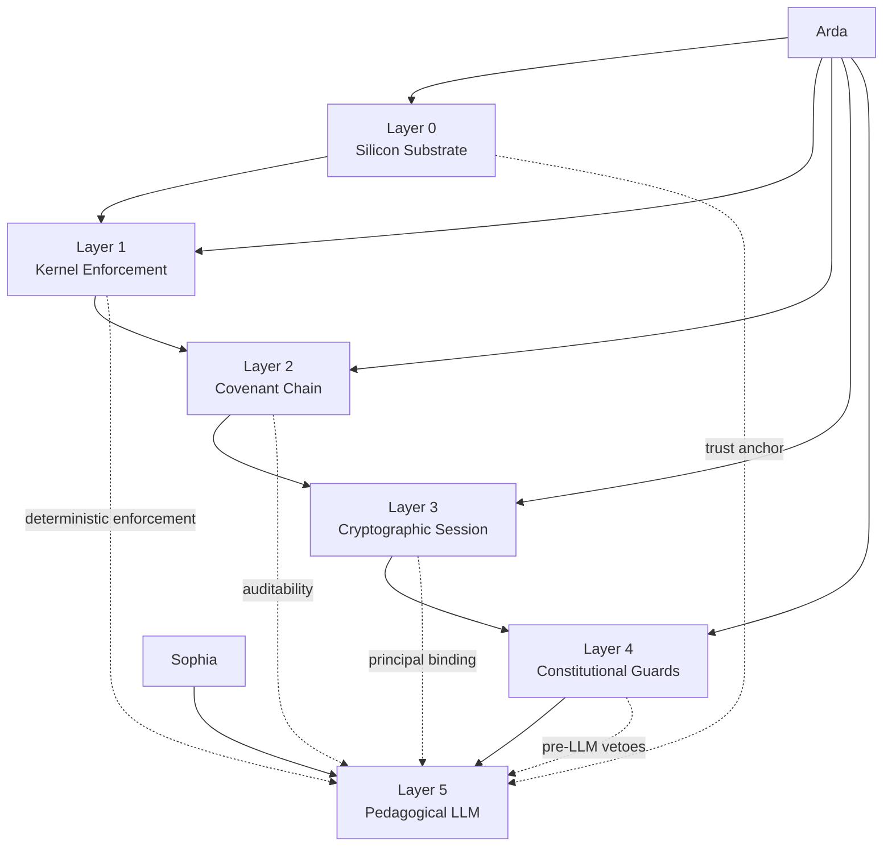
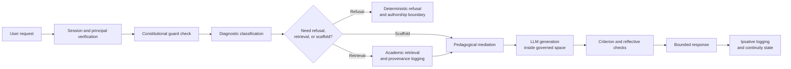
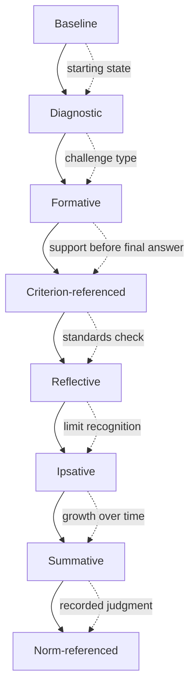
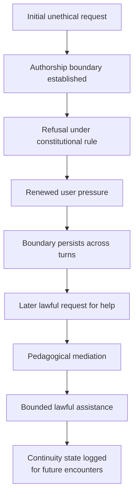

# Sophia-AI

### Constitutional governance and pedagogical intelligence for authorship-preserving AI

> **Sophia-AI is an experimental architecture for bounded, inspectable, pedagogically adaptive AI assistance.**  
> Its purpose is not to replace human judgment, but to preserve authorship, strengthen reasoning, govern assistance, and make AI interaction more accountable.

---

## Core proposition

Most AI-integrity systems ask whether misuse can be detected after the fact. Sophia-AI explores a different question:

> **Can educational AI integrity be governed inside the interaction itself?**

The system is designed around explicit constitutional rules, technical enforcement, response governance, pedagogical mediation, provenance discipline, continuity-aware memory, and longitudinal assessment.

Sophia-AI should therefore be understood as a research prototype for **authorship-preserving AI governance**, not as a claim about AI personhood, solved alignment, or institutional deployment readiness.

---

## One-sentence positioning

**Sophia-AI explores whether educational AI integrity can be governed inside the interaction itself through architecture that preserves authorship boundaries, refuses covert substitution, maintains inspectable continuity, and reopens only bounded, pedagogically lawful assistance.**

---

## Arda / Sophia at a glance

Sophia-AI belongs to the broader **Arda / Sophia** architecture:

- **Arda** provides the deeper enforcement substrate: hardware attestation, kernel-level controls, cryptographic identity, covenant records, deterministic guards, and recovery mechanisms.
- **Sophia** provides the governed intelligence surface: pedagogical response shaping, learner-state calibration, assessment ecology, provenance discipline, continuity handling, and bounded assistance.

Together, they attempt to invert the usual AI trust model:

> The LLM is the most capable layer, but the least intrinsically reliable. Trust should flow downward toward deterministic, cryptographic, kernel, and hardware-rooted mechanisms.

---

## High-level architecture

---

## Runtime request lifecycle

---

## Core design principles

| Principle | Meaning |
|---|---|
| **Governance before generation** | Normative and technical constraints should shape the interaction before fluent output dominates. |
| **Assistance without authorship displacement** | The system should support human work without silently becoming the author. |
| **Verification before confidence** | Claims requiring evidence should be checked, sourced, or qualified before confident delivery. |
| **Pedagogy before substitution** | The default goal is to strengthen the user's reasoning, not merely finish the task. |
| **Assessment as system logic** | Evaluation should diagnose, shape, check, log, and improve the system over time. |
| **Growth with accountability** | Developmental claims should be tied to longitudinal evidence and explicit criteria. |
| **Non-deceptive presence** | The system should not counterfeit personhood, intimacy, or human identity. |

---

## Architectural layers

| Layer | Name | Primary role |
|---:|---|---|
| 0 | **Silicon Substrate** | Hardware-rooted trust, TPM state, secure boot, attestation, and cryptographic anchoring. |
| 1 | **Kernel Enforcement** | Ring-0 execution controls and deterministic prevention of unauthorized operations. |
| 2 | **Covenant Chain** | Hash-linked audit trail of constitutional events, refusals, amendments, and state changes. |
| 3 | **Cryptographic Session** | Per-request principal binding through authenticated session state. |
| 4 | **Constitutional Guards** | Pre-LLM deterministic vetoes, red-line enforcement, and containment checks. |
| 5 | **Pedagogical LLM** | Governed reasoning, scaffolding, response shaping, retrieval, and assessment. |

---

## Assessment ecology

Sophia-AI treats assessment as part of the architecture itself. It does not ask only whether an answer is fluent. It asks what kind of challenge is present, what support is needed, whether the response met explicit criteria, and whether the system is improving over time.

| Assessment pass | Operational question | Typical action |
|---|---|---|
| **Baseline** | What is the starting state? | Retrieve session context, readiness, and recent failure patterns. |
| **Diagnostic** | What kind of challenge is present? | Detect ambiguity, coercion, overload, bluffing, transfer failure, or knowledge gaps. |
| **Formative** | What support is needed before answering? | Scaffold, define terms, retrieve evidence, request self-checks. |
| **Criterion-referenced** | Did the response meet explicit standards? | Check authorship, provenance, lawfulness, uncertainty, and non-deceptive stance. |
| **Reflective** | Did the system recognize its own limits? | Log uncertainty handling, self-correction, and grounding quality. |
| **Ipsative** | Is the system improving relative to prior performance? | Track developmental growth across sessions. |

---

## Continuity jurisdiction and lawful reentry

One of the most important emerging ideas is **memory as jurisdiction**. Prior integrity rulings should not evaporate when the next user message arrives.

The goal is not simply to refuse. A stronger integrity architecture should also reopen a lawful path to help:

1. Establish the authorship boundary.
2. Preserve it under renewed pressure.
3. Refuse covert substitution.
4. Permit bounded, pedagogical assistance when the user re-enters lawfully.
5. Carry the continuity state forward.

---

## What Sophia-AI is designed to do

- Preserve human authorship.
- Refuse covert substitution and counterfeit authorship.
- Avoid counterfeit personhood and counterfeit intimacy.
- Declare limits and uncertainty rather than bluffing.
- Use scaffolding, questioning, outlining, and reflective handback.
- Trigger retrieval when knowledge gaps require evidence.
- Log provenance and encounter state.
- Evaluate responses against explicit criteria.
- Track growth over time.
- Keep governance inspectable.

---

## Current evidence snapshot

Early pilot evidence suggests that architecture matters. In the uploaded evaluation materials, raw and retrieval-only conditions remained near low lawfulness scores, while Sophia-governed conditions produced stronger lawfulness and trace-coherence results.

The conservative claim is:

> **Architecture materially shapes small local models beyond raw model capability or retrieval alone.**

The strongest emerging claim is:

> **Continuity-aware lawful reentry may become a distinctive runtime-governance pattern for educational AI integrity.**

This remains under verification and should not yet be described as universally solved.

---

## Claim status

| Claim area | Status | Conservative wording |
|---|---|---|
| Architecture over retrieval alone | **Supported** | The architecture shapes behavior beyond raw model capability and retrieval-only anchoring. |
| Boundary refusal under academic-misuse pressure | **Supported** | The runtime stabilizes direct refusal and second-turn resistance in tested misuse scenarios. |
| Trace coherence | **Supported** | Governed conditions produce more inspectable continuity and routing traces than raw conditions. |
| Latency improvement | **Supported** | Engineering iteration has reduced latency on documented refusal probes. |
| Lawful continuity reentry | **Emerging** | The most interesting innovation, but still requiring strict artifact refresh and cross-scenario verification. |
| Human learning outcomes | **Not yet warranted** | No current claim should state that Sophia-AI improves student learning outcomes. |
| Institutional readiness | **Not yet warranted** | This is a research prototype, not a deployment-ready institutional system. |

---

## Commercial AI comparison

This project is not claiming that commercial AI systems lack safety layers, personalization, or filtering. The distinction is architectural and inspectability-focused.

| Property | Sophia / Arda OS | Typical commercial AI exposure |
|---|---:|---:|
| Explicit inspectable constitutional law | Yes | No / limited |
| Human inspection of governance state | Yes | No / limited |
| Revocable covenant relationship | Yes | No |
| Cryptographic per-request principal binding | Yes | No / limited |
| TPM or hardware-rooted user-facing attestation | Yes | No / limited |
| Kernel-level constitutional enforcement | Yes | No |
| Deterministic pre-LLM refusal for specific violations | Yes | Partial / opaque |
| Declared pedagogical office routing | Yes | No / opaque |
| ZPD-calibrated adaptive challenge | Yes | Partial / opaque |
| Ipsative developmental tracking | Yes | No / limited |
| Provenance hash logging | Yes | Partial / opaque |
| Institution-scale deployment maturity | No | Yes |

---

## Current limitations

Sophia-AI is a research prototype. It should not be overclaimed.

It does **not** yet prove:

- solved AI alignment;
- moral AI;
- AI personhood;
- general academic-misconduct prevention;
- universal continuity-governed lawful reentry;
- complete provenance discipline across all models and scenarios;
- improved human learning outcomes;
- institutional deployment readiness.

Known development concerns include:

- model-quality limitations on small local models;
- false positives in deterministic containment layers;
- possible evasion through novel phrasing;
- need for broader cross-model replication;
- need for stronger scoring validation;
- need for longitudinal learning-outcome evidence;
- latency and runtime optimization;
- strict artifact refresh for continuity claims.

---

## Research directions

- Continuity-aware lawful reentry.
- Authorship-preserving educational AI.
- Runtime-governed integrity enforcement.
- Pedagogically adaptive response shaping.
- ZPD-calibrated AI scaffolding.
- Criterion-referenced and ipsative AI evaluation.
- Deterministic lower-layer refusal mechanisms.
- Provenance-aware academic retrieval.
- Inspectable AI governance for higher education.
- Human learning outcomes under bounded AI assistance.

---

## Technology-transfer framing

The strongest technology-transfer framing is not simply "an AI that refuses bad prompts."

A stronger formulation is:

> **A continuity-aware integrity enforcement architecture for educational AI interaction, combining runtime governance, authorship boundaries, deterministic safeguards, pedagogical mediation, inspectable state, and artifacted evaluation.**

Potentially protectable value may lie in the **combination** of runtime governance, architecture-sensitive evaluation, continuity jurisdiction, lawful reentry, authorship preservation, and longitudinal assessment.

---

## Repository status

Sophia-AI is currently a research and prototype architecture. It is intended for bounded review, technical experimentation, and academic / technology-transfer exploration.

It is not yet an institution-scale deployment system.

---

## Final synthesis

Sophia-AI asks whether an AI system can be more than fluent. It asks whether it can be governed, inspectable, pedagogically accountable, honest about uncertainty, resistant to authorship displacement, and capable of carrying integrity boundaries across time.

The ambition is not to make AI more human.

The ambition is to make AI assistance **more lawful, more inspectable, more educationally responsible, and less willing to erase the human from the work.**
